> This is also my capstone project for Udacity Machine Learning Nanodegree Project. For this project, I build a Convolutional Neural Network little by little to have a better understanding of the CNN structure. 
> 
> In the `demo_code` folder, there are some python code for simple linear classifiers (logistic, SVM, softmax) and one-layer, two-layer neural network. Have fun.

# Capstone project -- Understand Neural Network from scratch
Author: Jiyao Li   
Date: January 24th, 2017  
Email: jiyao.lee@gmail.com

## Introduction
Neural Network (NN) is an import branch of Artificial Intelligence and Machine Learning. NN has capability of building and training a model to identify different complicated classes, which is not achievable with conventional linear/nonlinear classifiers, such as Softmax regression, SVM, etc. In addition, we all know that NN is a super hot topic nowadays.  

So I decided to study and explore Neural Network as my capstone project. However, after I tried several open-source NN packages, such as Caffe, Tensorflow, although they works quite well and fast, I still could not really understand how NN works, since these packages are all like a "black box" to me. Then, I started writing NN code from scratch and used several dataset to test my code. Based on the testing results, I think my code works. And through this process, I developed a much better understanding of the structure of NN and its features. 

I found several really good sources online to learn how to develop NN from scratch. The one I like the most is the class note of Stanford class CS231n, [Convolutional Neural Networks for Visual Recognition](http://cs231n.github.io/). This class teaches you how to build the basic architecture of a simple NN and then expand it to more and more complex structures like multi-layer NN and Convolutional Neural Network. Another good source is the [Deep Learning Tutorial](http://ufldl.stanford.edu/tutorial/) contributed by Andrew Ng and others. Actually, several major parts of my capstone project is based on the homework assignment 2 of the CS231n class. 

## Problem description

### Method and Metrics
Just like other classification problems in supervised learning, we are provided with labeled dataset to train a model. Out best-trained model should be able to predict the labels of dataset as close to the true labels as possible.

The Metrics used to judge the quality of the prediction is accuracy, which is the ratio of the number of the correctly predicted labels to the total number of labels. The most solid way to train a model is to first split the whole dataset into three subsets, training data, cross-validation data and testing data. A typical ratio of the split could be 60%-20%-20%. Model will be initially trained on the training set, then on the validation set to tune the hyper-parameters in the model. Finally the performance of the model will be tested on the testing set. 

The ultimate goal of this project is to fully understand the structure of the Convolutional Neural Network, and build a Convolutional Neural Net to train with real-world dataset, [CIFAR-10](https://www.cs.toronto.edu/~kriz/cifar.html). After training, testing different components and parameters of the CNN on small-scale dataset, two complex Conv Net were trained with the full training set and form an ensemble model to predict on the validation set and testing set. (Yes, I should tune the hyper-parameters even more based on the validation score. However, it takes too long to train the Conv Net using CPU, which was built from scratch using python without optimized speed performance.) Finally, the accuracy on the training set reaches ~97% and over 80% on the validation set and testing set. Although this score is not as good as some of the [best scores](http://rodrigob.github.io/are_we_there_yet/build/classification_datasets_results.html) achieved on CIFAR-10 so far, my score beats scores of several early-published models as well as a [Udacity MLND template project](https://github.com/udacity/machine-learning/blob/master/projects/capstone/report-example-2.pdf) doing similar work training CNN model on CIFAR-10 dataset. The Udacity template project achieved 70% accuracy and used TensorFlow package, which is not comparable to the work I did from scratch.

Before getting to the complex Convolutional Neural Network, to fully understand CNN (and Neural Network in general), I start with very simple synthetic dataset and compare the Neural Network model with basic linear classifiers, e.g. logistic regression, SVM, softmax regression. Neural Network clearly show greater power over simple linear classifier for datasets with complicated patterns to separate. After successfully build a Neural Network model, it was tested on MNIST dataset and easily achieved over 90% accuracy on the testing set. However, fully-connect Neural network is not doing well on the CIFAR-10 dataset and only achieved ~55% accuracy even with 5 hidden layers and some parameter tuning. 

By doing this project, I developed good understanding of each components in Neural Network and Convolutional Neural Network, as well as their difference. Details will be discussed in each Section. 

### Data 
The datasets used in this project are:

- The [CIFAR-10 dataset](https://www.cs.toronto.edu/~kriz/cifar.html) consists of 32x32 3-color images in 10 classes (plane, car, bird, cat, deer, dog, frog, horse, ship, truck). The input features are the values of each pixels, for color Red, Green or Blue. The range of the pixel values are 0--255. In total, there are $32\times32\times3=3072$ features. The whole dataset was split into 49,000 training examples, 1000 validation examples and 1000 testing examples. In the validation and testing dataset, we are going to use the trained model on the training set, to use the images as input and predict its class label. Then the predicted class label will be compared with the true class label to estimate accuracy.

    It is very important to zero-center the data, and it is common to see normalization of every pixel as well. Preprocessing of the CIFAR-10 dataset is simply removing the mean of each feature. However, the features are not normalized, since the following batch normalization (Section 2.2) has similar effect by doing zero-center and normalize the output of each layer in the Neural Network.

```python
    # Preprocessing of CIFAR-10 dataset: Normalize the data, subtract the mean image  
    mean_image = np.mean(X_train, axis=0)  
    X_train -= mean_image  
    X_val -= mean_image  
    X_test -= mean_image  
``` 

<p align="center">
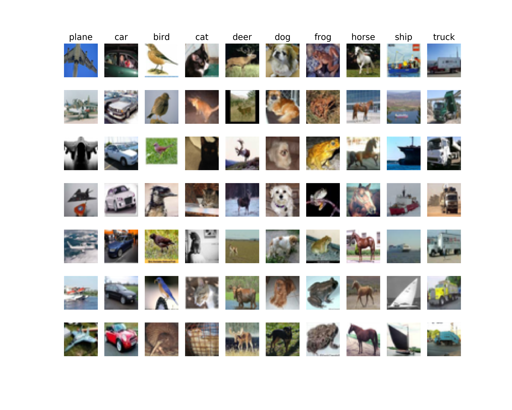
<br>
Figure 1. - Seven random sample images of each class. 
</p>

- The [MNIST database of handwritten digits](http://yann.lecun.com/exdb/mnist/), has 70,000 32x32 gray-scale images in 10 classes (digit 0 to 9). This dataset is split into 60,000 training examples, 10,000 testing examples. In total, there are 1024 features. Since I did not focus on improving the prediction on MNIST dataset, and the images are in grayscale with similar range of values, this image was not preprocessed. There is also no validation set for this dataset because I did not spend much efforts tuning the hyper-parameters and Neural net structure for this dataset. MNIST is used to test the simple one-layer and two-layer Neural Net I built, which to my surprise, gives very high accuracy on the testing set (over 92%).

    Figure 2. shows some samples of the MNIST dataset. As you see, some digits can be easily recognized. But some are quite scratchy and even difficult for human to recognize.

<center>
<p align="center">
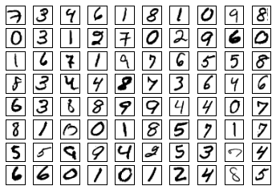
<p>
</br>
Figure 2. - Eighty samples of the MNIST dataset, handwriting digits.
</center>

- Synthetic data, with two features (x and y coordinate), are either in two clusters or three clusters with  unique labels for each cluster. These clusters are separated from each other but some of them are linearly separable and some are not. 

    These synthetic dataset will be used to test and compare basic linear classifiers, e.g. logistic regression, SVM, softmax regression and the simple Neural Network model. As you will see, the linearly separable clusters could be easily classified using the linear classifiers. But the non-linearly separable clusters can only be  correctly classified using the Neural Net.

<p align="center">
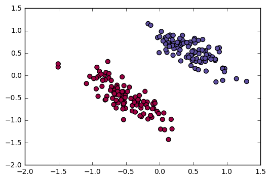
<br>
Figure 3. - Two-class linearly separable synthetic data. Each class reprents one unique label.
</p>

<p align="center">
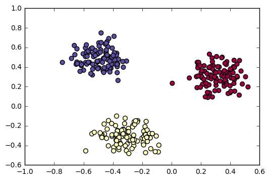
<br>
Figure 4. - Three-class linearly separable synthetic data. Each class reprents one unique label.
</p>

<p align="center">
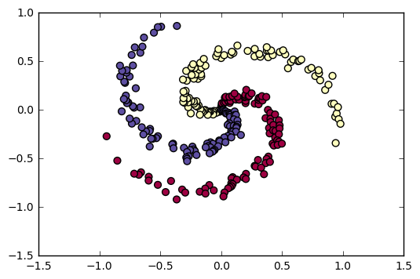
<br>
Figure 5. - Three-class non-linearly separable synthetic data. Each class reprents one unique label.
</p>

I did not include the MNIST and CIFAR-10 dataset since they are too large. But it is easy to download them from the link I provided above.


## Code and Algorithm description
> If you use Anaconda python, the codes should run smoothly. Just pay attention that except for `LossGradientClassifiers.ipynb` and `CNN_Note_Convolution.ipynb`, which run on `Python 3`, all the other codes and notebooks run on `Python 2`.
> 
> For Convolutional Neural Networks to run fast. We have implemented of the functionality using [Cython](http://cython.org/); you will need to compile the Cython extension before you can run the code. From the `cs231n` directory, run the following command:
> 
> ```bash
> python setup.py build_ext --inplace
> ```

I use Jupyter notebook for all the following sections. Please check the associated html file for the details of coding and results.

- LossGradientClassifiers.ipynb -> *Section 1* ```Python 3```
- FullyConnectedNets.ipynb -> *Section 2* ```Python 2```
    - Dropout.ipynb -> *Section 2.1* ```Python 2```
    - BatchNormalization.ipynb -> *Section 2.2* ```Python 2```
- ConvolutionalNetworks.ipynb -> *Section 3* ```Python 2```
    - CNN_Note_Convolution.ipynb -> *Section 3.1* ```Python 3```

I worked on the assignment of Stanford class CS231n and included some parts into this reports. So the cs231n folder has lots of facilitating code written by CS231n instructors, including visualization, solver, structures of Neural Network model (just empty class and empty member functions). Notebooks, `FullyConnectedNets.ipynb, Dropout.ipynb, BatchNormalization.ipynb, ConvolutionalNetworks.ipynb`, are the homework assignment of CS231n. Of course, they just has some framework to check whether your solution is correct and students need to fill in those four notebooks.

----------
**Structures of (Convolutional) Neural Network**

<p align="center">

<br>
Figure 6. - Basic component in Neural Net, connection of neurons in the previous layer to one neuron inthe next layer, which is computing a dot product of their weights with the input followed by a non-linearity activation function.
</p>

<p align="center">

<br>
Figure 7. - Simple one-hidden-layer Neural Net model. The output layer is just a linear classifier, such as softmax.
</p>

<p align="center">

<br>
Figure 8. - Demonstration of a Convolutional Layer. Compared with the fully-connected layer, the  main differences are: 1) the input is just a smaller region of the whole input data; 2) the output for one regional input is positioned horizontally and form a 3D output for all the regional input combined. 
</p>

<p align="center">

<br>
Figure 9. - Several Convolutional layers connected.
</p>

<p align="center">

<br>
Figure 10. - A complex Convolutional Neural Net, which is Conv layer -> pooling -> Conv layer -> pooling -> two fully-connected layer -> out prediction.
</p>

----------

The Codes and Jupyter notebooks that I wrote are listed as below:

`LossGradientClassifiers.ipynb` contains summary and comparison between different linear classifiers and simple Neural Network.

`CNN_Note_Convolution.ipynb` contains my personal note and understanding of the "Convolutional Neural Network". Among different resources I can find online, I think my note most clearly explains why CNN is called "Convolutional" and how to implement the forward and backward propagation.

```layers.py``` has all the founding bricks for neural net:
```python
def affine_forward(x, w, b) 
# Computes the forward pass for an affine (fully-connected) layer.
def affine_backward(dout, cache) 
# Computes the backward pass for an affine layer.
def relu_forward(x) 
# Computes the forward pass for a layer of rectified linear units (ReLUs).
def relu_backward(dout, cache) 
# Computes the backward pass for a layer of rectified linear units (ReLUs).
def batchnorm_forward(x, gamma, beta, bn_param) # Forward pass for batch normalization.
def batchnorm_backward(dout, cache) 
# Backward pass for batch normalization.
def dropout_forward(x, dropout_param) 
# Performs the forward pass for (inverted) dropout.
def dropout_backward(dout, cache) 
# Perform the backward pass for (inverted) dropout.
def conv_forward_naive(x, w, b, conv_param) 
# An implementation of the forward pass for a convolutional layer.
def conv_backward_naive(dout, cache) 
# An implementation of the backward pass for a convolutional layer.
def max_pool_forward_naive(x, pool_param) 
# An implementation of the forward pass for a max pooling layer.
def max_pool_backward_naive(dout, cache)
# An implementation of the backward pass for a max pooling layer.
def spatial_batchnorm_forward(x, gamma, beta, bn_param) 
# Computes the forward pass for spatial batch normalization.
def spatial_batchnorm_backward(dout, cache) 
# Computes the backward pass for spatial batch normalization.
def svm_loss(x, y) 
# Computes the loss and gradient using for multiclass SVM classification.
def softmax_loss(x, y) 
# Computes the loss and gradient using for multiclass Softmax classification.
```

```layer_utils.py``` has some convenient wrapper of this bricks to form founding blocks.
```python
def affine_relu_forward(x, w, b) 
# Convenience layer that perorms an affine transform followed by a ReLU
def affine_relu_backward(dout, cache) 
# Backward pass for the affine-relu convenience layer
def conv_relu_forward(x, w, b, conv_param) 
# A convenience layer that performs a convolution followed by a ReLU.
def conv_relu_backward(dout, cache) 
# Backward pass for the conv-relu convenience layer.
def conv_relu_pool_forward(x, w, b, conv_param, pool_param) 
# Convenience layer that performs a convolution, a ReLU, and a pool.
def conv_relu_pool_backward(dout, cache) 
# Backward pass for the conv-relu-pool convenience layer
def conv_norm_relu_pool_forward(x, w, b, gamma, beta, conv_param, pool_param, bn_param) 
# Convenience layer that performs a convolution, a spatial batch normalization, a ReLU, and a pool.
def conv_norm_relu_pool_backward(dout,cache) 
# Backward pass for the conv-norm-relu-pool convenience layer
def affine_norm_relu_forward(x, w, b, gamma, beta, bn_param) 
# Convenience layer that performs an affine, a batchnorm, and a ReLu.
def affine_norm_relu_backward(dout,cache) 
# Backward pass for the affine-batchnorm-relu convenience layer
```

```optim.py``` has all different ways to update the parameters:
```python
def sgd(w, dw, config=None)  # Performs vanilla stochastic gradient descent.
def sgd_momentum(w, dw, config=None) # Performs stochastic gradient descent with momentum.
def sgd_Nesterovmom(w, dw, config=None) # Performs stochastic gradient descent with Nesterov Momentum.
def rmsprop(x, dx, config=None) # Uses the RMSProp update rule
def adagrad(x, dx, config=None) # Uses the Adagrad update rule
def adam(x, dx, config=None) # Uses the Adam update rule
```
For more information about these parameter update methods, visit [CS231n class notes](http://cs231n.github.io/neural-networks-3/), [Sebastian Ruder blog](http://sebastianruder.com/optimizing-gradient-descent/), [Int8 blog](http://int8.io/comparison-of-optimization-techniques-stochastic-gradient-descent-momentum-adagrad-and-adadelta/#AdaDelta_8211_experiments).

Among all these methods for parameter updating, `Adam` seems to be the best one for Neural Net model.

<p align="center">

<br>
Figure 11. - Different parameter update methods. Adam has the best performance on the validation accuracy score. And AdaGrad (including AdaDelta) does not do well with Neural Net, which is known.
</p>

 ```cs231n/classifiers/fc_net.py``` is fully-connect Neural Net and has two classes:
- `class TwoLayerNet(object)`  A two-layer fully-connected neural network with ReLU nonlinearity and
  softmax loss.

- `class FullyConnectedNet(object)` is a fully-connected neural network with an arbitrary number of hidden layers, ReLU nonlinearities, and a softmax loss function. This will also implement dropout and batch normalization as options. For a network with N hidden layers, the architecture will be
 `{affine - [batch norm] - relu - [dropout]} x (N) - affine - softmax `

```cs231n/classifiers/cnn.py``` contains `class ThreeLayerConvNet(object)`, which is a three-layer convolutional network with the following architecture:
`conv - [spatial batch norm] - relu - 2x2 max pool - affine - relu - affine - softmax`

```cs231n/classifiers/complex_cnn.py``` contains `class MineConvNet(object)`, which is the more complex CNN as the final model to train the CIFAR-10 dataset, it also has a flexible structure (N Conv layers and M fully-connect layers) for the user to define:
`(conv-[spatial batch norm]-relu-pool) X N - (affine-[batch norm]-relu-[dropout]) X M - affine - softmax ` 


## Section 1 -- Basics of Logistic Regression, Softmax Regression, SVM and Simple Neural Network
> Dataset: Synthetic dataset, MNIST dataset  
> File: LossGradientClassifiers.ipynb

Even for the Neural Network model, taking out all the hidden structures between the input the and output layer, it will simply be a Softmax or multiclass SVM linear classifier. So we should first understand these linear classifiers before digging into the Neural Net. Some commonly used linear classifiers are Logistic regression, binary SVM for binary classes, Softmax regression and multi-class SVM for multiple classes. I summarized the differences between different classifiers, their limitations and capabilities with synthetic examples.

### Theory --  Different classifiers and their loss function and gradient

#### Loss function and Gradient
In neural network, there are lots of linear relationships between the neurons (variables within the neural network). 

Take the simpliest case, where the input $X$ is of dimension $N\times D$, with $D$ features and $N$ instances. There are $C$ classes to be identified. ($x_i$, $y_i$) is one instance, where $x_i$ is a row of $X$ and $y_i$ is a number to represent one class. $y_i \in \{0 \dots C-1 \}$ The weight parameter of the linear relationship is $W$, of dimension $D \times C$. There is also another parameter called bias, $b$, which just give some shift and has dimension of $C$.

To simplify the notations, we define,
$f(x_i;W,b)=W^T x_i+b$
In which,
$w_j$ is the $j$th column of $W$, $b_j$ is the $j$th item of $b$.

We also define,
$f_j^i=f(x_i;W,b)_j=w_j^T x_i+b_j$


##### Loss function
The total loss functions is defined to be a combination of data loss and regularization term on parameters.
$$
L=\frac{1}{N}\sum_i^{N} L_i+\frac{1}{2}\lambda||W||^2
$$

Here the regularization on weight is defined as L2 norm.

##### Gradient

$$
\frac{\partial L}{\partial w_j}=\frac{1}{N}\sum_i^{N}\frac{\partial L_i}{\partial w_j}+\lambda w_j \\\
\frac{\partial L}{\partial b_j}=\frac{1}{N}\sum_i^{N}\frac{\partial L_i}{\partial b_j}
$$

Both the loss function and the form of gradient calculation are in general form. Different regression methods defined different form of $L_i$.


#### Binary classes
For binary classes, we just need to predict one of the two classes. If one class is less likely, then the other class should be the most possible one. 

In binary classes case, the weights collapse from matrix $W$ to a vector $w$ of size $C$. The bias also collapse from a vector to a scalar, but still denoted as $b$ for reason of being lazy. 

##### Logistic regression
In logistic regression, define the probability of $y$ as $p(y)=\sigma(y)$,
where $\sigma(y)$ is the "sigmoid" or "logistic" function,
$\sigma(y)=\frac{1}{1+e^{-y}}$. $y_i \in \{0,1\}$. To predict $y$ with $x_i$, simply check wether $p(f(x_i;w,b))$ is closer to 1 or 0. (Or just check the sign of $f(x_i;w,b)$). Logistic regression nicely give the probability of the prediction in addition to the prediction itself. 

**Loss**
$$
L_i=-(y_i \log(p(f(x_i;w,b)))+(1-y_i)\log(1-p(f(x_i;w,b))))
$$

**Gradient**
$$
\frac{\partial L}{\partial w}=x_i(p(f(x_i;w,b)-y_i) \\\
\frac{\partial L}{\partial b}=(p(f(x_i;w,b)-y_i)
$$


##### Binary SVM
In binary SVM, for convenience purpose, set $y_i \in \{-1,1\}$, To predict $y$ with $x_i$, simply check wether $f(x_i;w,b)$ is positive (indicate $y_i = 1$) or negative (indicate $y_i = -1$). 

**Loss**
$$
L_i=C\max(0,1 -  y_i f(x_i;w,b) )
$$

$C$ is a hyper-paramter. However, because we have included the regularization, which has the same effect, $C$ can be set to one. 

**Gradient**

$$
\frac{\partial L}{\partial w} =
\begin{cases}
-x_i y_i,  & \text{if $1 -  y_i f(x_i;w,b)>0$} \\\
0, & \text{else}
\end{cases}
$$

$$
\frac{\partial L}{\partial b} =
\begin{cases}
-y_i,  & \text{if $1 -  y_i f(x_i;w,b)>0$} \\\
0, & \text{else}
\end{cases}
$$


#### Multiple classes

##### Softmax regression

Softmax regression is a general form of logistic regression for multiclass case. In softmax regression, define probability $p(y=k|x_i)=\frac{e^{f_{k}^i}}{\sum_j e^{f_{j}^i}}$. To predict, just check which $k$ gives the largest probability $p(y=k|x_i)$.

**Loss**
$$
L_i=-\log(p(y_i|x_i))
$$

**Gradient**
$$
\frac{\partial L_i}{\partial w_j}=x_i(p(y_i|x_i)-1(y_i=j)) \\\
\frac{\partial L_i}{\partial b_j}=(p(y_i|x_i)-1(y_i=j))
$$


##### Multiclass SVM
Multiclass SVM regression is a general form of binary SVM regression for multiclass case. To predict, just check which $k$ gives the largest value of $f(x_i;W,b)_k$.

**Loss**

$$
L_i=\sum_{j \neq y_i} \max(0,f_j^i -f_{y_i}^i + \Delta )
$$

$\Delta$ is the margin, a hyper-paramter. However, because we have included the regularization, which has the same effect, $\Delta$ can be set to one. 

**Gradient**

for $j=y_i$
$$
\frac{\partial L_i}{\partial w_{y_i}}=-(\sum_{j\neq y_i} 1(f_j^i - f_{y_i}^i+\Delta>0))x_i \\\
\frac{\partial L_i}{\partial b_{y_i}}=-(\sum_{j\neq y_i} 1(f_j^i - f_{y_i}^i+\Delta>0))
$$

for $j\neq y_i$
$$
\frac{\partial L_i}{\partial w_j}=1(f_j^i - f_{y_i}^i+\Delta>0)x_i \\\
\frac{\partial L_i}{\partial b_j}=1(f_j^i - f_{y_i}^i+\Delta>0)
$$


### Working with synthetic dataset

The synthetic dataset have been described in the previous section. For the linear classifiers, whether for synthetic data with binary classes or multiple classes, as long as different cluster can be linearly separated, the linear classifiers can be trained on these data to correctly predict their labels.  

<p align="center">
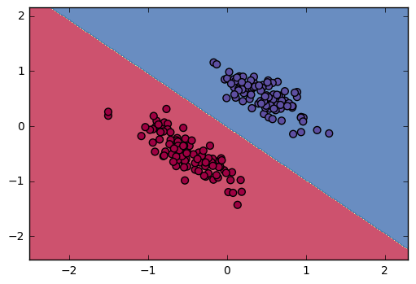
<br>
Figure 12. - Logistic regression and Binary SVM classifier can successfully predict the labels.
</p>

<p align="center">
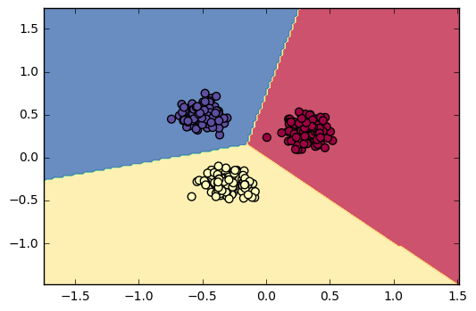
<br>
Figure 13. - Softmax regression and multi-class SVM classifier can successfully predict the labels.
</p>

However, when the synthetic data is not linearly separable, linear classifiers can not correctly predict their labels. This is the moment Neural Network starts to show its power. Even simple Neural Net with one hidden layer can predict the labels with high accuracy (97%). And I have tested different activation functions, including ReLu, Sigmoid, Tanh functions. Among them, ReLu has the best convergence speed and stability. For details, check `LossGradientClassifiers.ipynb`. 

<p align="center">
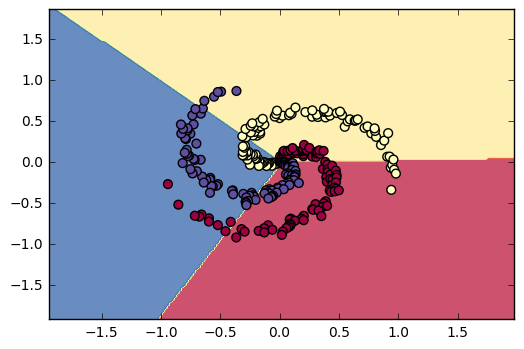
<br>
Figure 14. - Linear classifiers failed to predict the labels. Accuracy is ~50%.
</p>

<p align="center">

<br>
Figure 15. - One-layer Neural Net model with ReLu activation function predict the synthetic datset with 97% accuracy.
</p>

  

#### Simple Neural Network model trained with MNIST dataset

The simple Neural Network is also applied to MNIST hand-writing digits dataset. With my code for one-layer and two layer Neural Net models, the predicted labels has high accuracy on both the training set and testing set (over 90%). For details, check `LossGradientClassifiers.ipynb`. 

With one-layer Neural Net model:
After 2000 iterations
training accuracy: 93%
test set accuracy: 92%

With two-layer Neural Net model:
After 4000 iterations
training accuracy: 96%
test set accuracy: 93%

------

Later we will use CIFAR-10 data to train our Neural Net models. CIFAR-10 data is much more complicated than the MNIST data. As you will see, simple Neural Net model will not do well with CIFAR-10 data. And even multi-layers fully-connected Neural Net model can not predict the labels on the validation set with high accuracy. For CIFAR-10, we need to use more complicated Convolutional Neural Net models.

## Section 2. Fully connected neural network
> Dataset: CIFAR-10 dataset  
> File: FullyConnectedNets.ipynb

This Section build more complex fully-connected Neural Network and train it with more complex CIFAR-10 dataset. After having the foundation of modules of forward propagation and backpropagation of a fully-connect layer, we can easily build more complicated neural network with arbitrary number of hidden layers.

With the entire 49,000 training dataset, one-layer fully-connected Neural Net with 200 neurons in the hidden layer gives 52% accuracy on the validation set. Five-layer fully-connected Neural Net with 100 neurons in each hidden layer gives 54.3% accuracy on both the validation set and testing set. These accuracy scores are far from satisfying. We will develop more complex Convolutional Neural Network models in the next section and achieve much better accuracy score.

<p align="center">
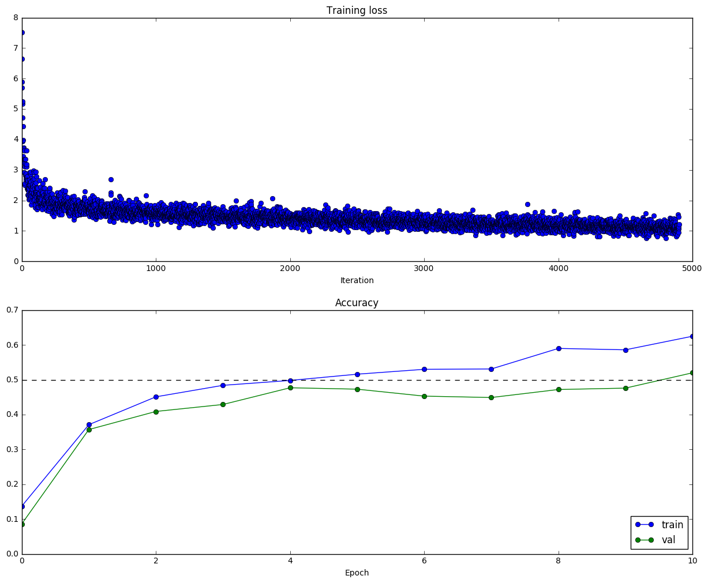
<br>
Figure 16. - One-layer Neural Net model with 200 neurons in the hidden layer. Parameters for this run is num_epochs=10, batch_size=100, iterations=4900. Training accuracy is 62.5%, validation accuracy is 52%. 
</p>

<p align="center">
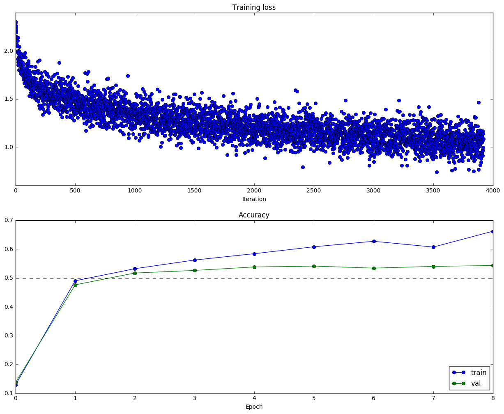
<br>
Figure 17. - Five-layer fully-connected Neural Net with 100 neurons in each hidden layer. Parameters for this run is num_epochs=8, batch_size=100, iterations=3920. Training accuracy is 66.2%, validation accuracy is 54.3%, testing accuracy is 54.3%. 
</p>


----------

This section also applies the Dropout and Batch normalization. Dropout help overcome overfitting problem and will give better accuracy score on the validation and testing set. Batch normalization normalize the output of each Neural layer and reduces the sensitivity to the initialization of the weight, which is another hyper-parameter to turn without batch normalization. Dropout and Batch normalization will be explained in the following two sub-sections.

### Section 2.1. Dropout
> Dataset: CIFAR-10 dataset
> File: Dropout.ipynb

Dropout seems to be a "Mysterious" technique. In practice, dropout avoid overfitting and relying too much on some nodes by randomly ignoring them. [CS231n dropout section](http://cs231n.github.io/neural-networks-2/) shows how to do the dropout in practice.

<p align="center">

<br>
Figure 18. - During training, Dropout can be interpreted as sampling a Neural Network within the full Neural Network, and only updating the parameters of the sampled network based on the input data. 
</p>

<p align="center">
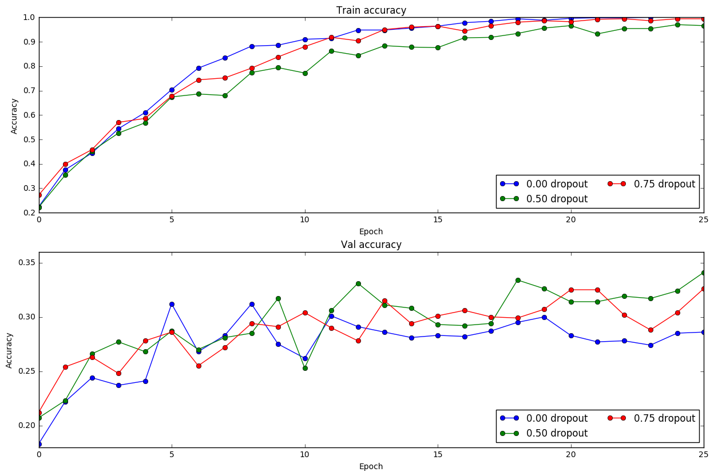
<br>
Figure 19. - 0 dropout means no dropout is applied. 0.5 and 0.75 dropout mean 50% and 25% of the input data is randomly discarded in each iteration of training. This figure clearly shows that dropout give better validation score although the training score is not as good as without dropout. However, validation and testing score is the most important metrics for the model.
</p>

### Section 2.2 Batch normalization and spatial batch normalization 
> Dataset: CIFAR-10 dataset
> File: BatchNormalization.ipynb

Batch normalization normalize the input before the activation function to be zero mean and unit variance. In practice, using batch normalization will make the neural network less sensitive to value of weight scale used in weight initialization. [Clément thorey's blog](http://cthorey.github.io./backpropagation/) gives nice explanation of batch normalization. Actually, once you know the equation of batch normalization, it should be quite easy to derive the form of backpropagation (just use the chain rule).

<p align="center">
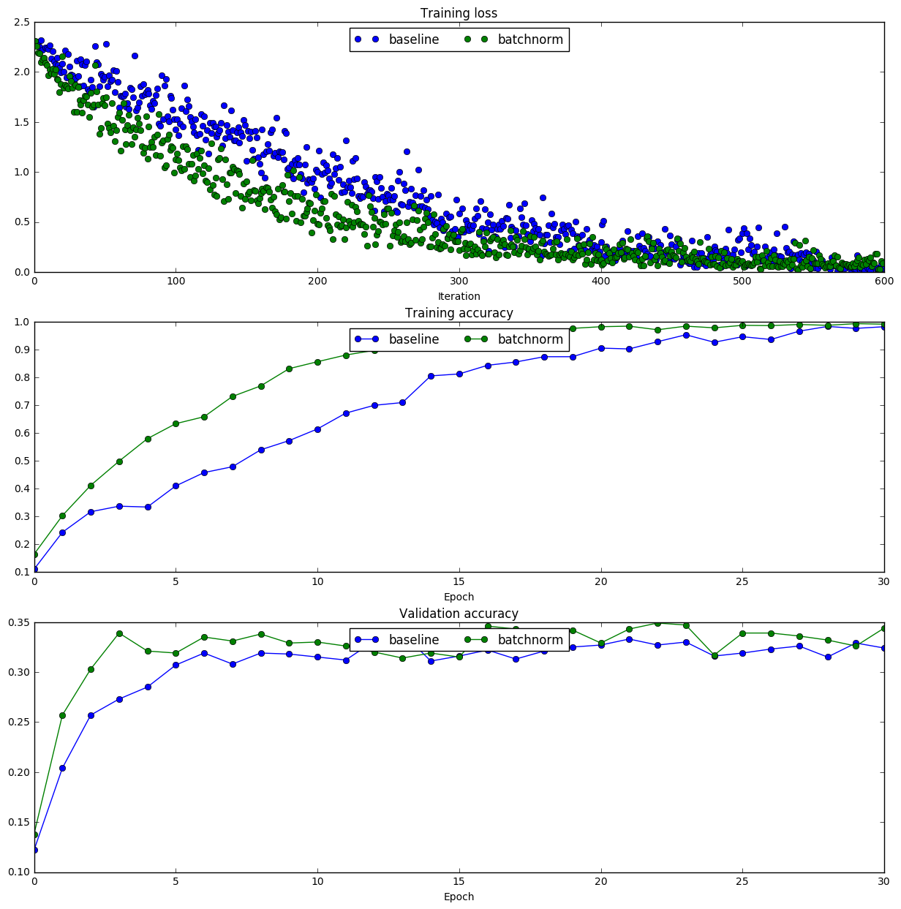
<br>
Figure 20. - In the baseline model, the weight scale for the weight initialization is 0.02. It is clear that with batch normalization, both the training accuracy and the validation accuracy are improved. 
</p>

<p align="center">
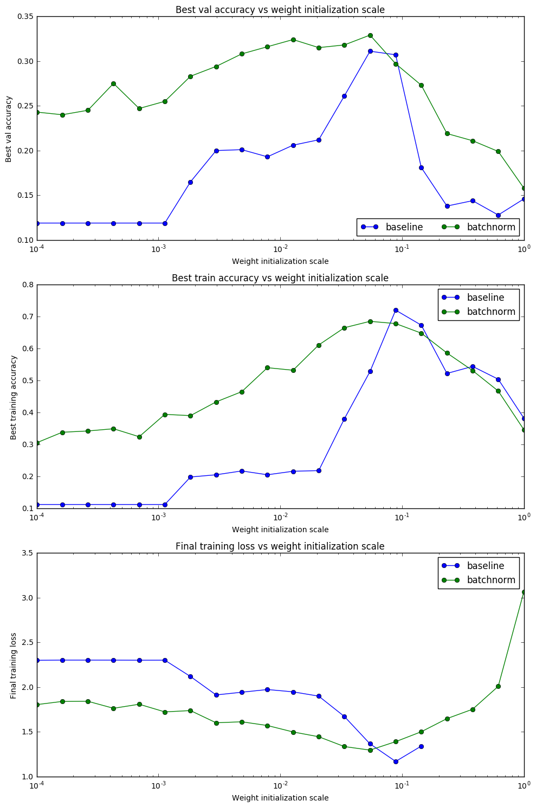
<br>
Figure 21. - Without batch normalization, only the weight initialization scale around $10^{-1}$ gives the best score, while other weight initialization scale values give much worse accuracy score. However, with the batch normalization, the difference between different weight initialization scale is not so dramatic.
</p>

## Section 3 Convolutional neural network
> Dataset: CIFAR-10 dataset
> File: ConvolutionalNetworks.ipynb

Eventually, we come to the powerful Convolutional Neural Network! The first simple Conv Net model trained on the CIFAR-10 dataset looks like:

`conv - spatial batch norm - relu - 2x2 max pool - affine - relu - affine - softmax`

This is the most basic Conv Net model. After 980 iterations with batchsize=50, the training accuracy is 50.8% and validation accuracy is 52.2%. This score makes Conv Net models promising in achieving better accuracy scores after building a more complicated Conv Net model. In the Conv layer, 32 filters was used. In this figure below, each filter represents some edge features or color patterns. 

<p align="center">
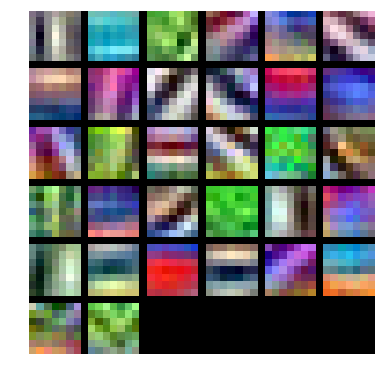
<br>
Figure 22. - Weights of 32 filters in the Conv Net model trained on CIFAR-10 dataset.
</p>

Eventually, I build a flexible CNN (`class MineConvNet` in cs231n/classifiers/complex_cnn.py), allowing user to expand the number of the Convolutional layers and number of the fully-connected layers. MineConvNet also included the functionality of dropout for the fully-connected layers, batch normalization and spatial batch normalization for the full-connected and convolutional layers respectively.

There are two models I trained on CIFAR-10 dataset:

Model 1: `(conv-spatial batch norm-relu-pool) X 3 - (affine-batch norm-relu-dropout) X 1 - affine - softmax ` 

Model 2: `(conv-spatial batch norm-relu-pool) X 3 - (affine-batch norm-relu-dropout) X 2 - affine - softmax ` 

These two Conv Net Models are slightly different in structure. Model 1 has 3 Conv layers with filter size [32, 32, 32] and 1 following fully-connected layer, size [500]. Model 2 has 3 Conv layers with filter size [16, 32, 64] and 2 following fully-connected layer, size [256, 256]. Both models were trained for 49,000 iterations, with batch_size=50, num_epochs=50. The training and validation accuracy scores on Model 1 are 96.5% and 79.5%, on Model 2 are 97.7%, 78.3%. 

In the end, I created an ensemble model by combining these two trained Conv Net models. Prediction with the ensemble model gives accuracy of the validation set and testing set to be 80.4% and 80.3%. It is a huge improvement from the fully-connected network, which is just 55% on testing score. 

The 80% accuracy score was achieved without extensive testing on hyper-parameters. If optimal parameters and Conv Net structures were chosen, I believe the accuracy score will be further improved. Because all of my code is in python (using numpy a lot), it is too too slow to train the complex models (Several hours for the final complex Conv Net model to run 50 epochs). It is definitely necessary to use GPU to train more complex Neural Network models. But I don't have the time and efforts at this moment to rewrite all these code into CUDA C. This is some future task for myself. 


### Section 3.1 CNN forward propagation and backpropagation
> File: CNN_Note_Convolution.ipynb

After I understand the structure of normal Neural Network with just fully-connected layers, I was puzzled by Convolutional Neural Network. Why is it called "Convolutional", because convolution is a technique in signal or image processing. And how is the structure different from full-connect Neural Net and how to do forward and backward propagation with Convolutional Neural Network. Below is my notes on the math and tricks for Convolutional Neural Network foward and backward propagation. I have coded my understanding and it passed the unit test. For details, check `CNN_Note_Convolution.ipynb`.

#### Convolutional Neural Network implementation
In CNN, the input image $X$ is of dimension $N\times C \times H \times W$, the filter $F$ is of dimension $F\times C \times HH \times WW$, the output $Y$ is of dimension $N\times F\times Hd \times Wd$. In this note, for simplicity reason, we look at one input example ($N=1$), assume one color layer of input ($C=1$), only one filter ($F=1$), thus all the input, filter, output are 2d matrices.


##### Forward propogation
$X$ is of dimension $H \times W$, $F$ is of dimension $HH\times WW$, if the padding size is $P$, the stride is $S$, then the output $Y$ has dimension $Hd\times Wd$.
$$
Hd=1+(H+2P-HH)/S \\\
Wd=1+(W+2P-WW)/S
$$

$$
Y_{kl}=\sum_{i=0}^{HH-1} \sum_{j=0}^{WW-1} F_{ij} X_{i+kS, j+lS}
$$

Or we can write this equation in another form
$$
Y_{kl}=\sum_{m=kS}^{HH-1+kS} \sum_{n=lS}^{WW-1+lS} F_{m-kS,n-lS} X_{mn}
$$

If we make a very simple neural network, without hidden layer and activation function. The loss function is defined as
$$
L=\sum_k^{Hd-1} \sum_l^{Wd-1} f(Y_{kl})
$$
$f()$ is some defined function to calculate the total loss. 

Then the Gradient $L$ with respect to $X$ and $F$ are
$$
\begin{align}
\frac{\partial L}{\partial F_{ij}}&=\sum_k^{Hd-1} \sum_l^{Wd-1} f'(Y_{kl})\frac{\partial Y_{kl}}{\partial F_{ij}} \nonumber \\\
&=\sum_k^{Hd-1} \sum_l^{Wd-1} f'(Y_{kl})X_{i+kS,j+lS} \nonumber
\end{align}
$$

$$
\begin{align}
\frac{\partial L}{\partial X_{mn}}&=\sum_k^{Hd-1} \sum_l^{Wd-1} f'(Y_{kl})\frac{\partial Y_{kl}}{\partial X_{mn}} \nonumber \\\
&=\sum_k^{Hd-1} \sum_l^{Wd-1} f'(Y_{kl})F_{m-kS,n-lS} \nonumber
\end{align}
$$
in which, $f'(Y)$ is of dimension $Hd\times Wd$, same as $Y$.

##### Where is convolution? Why $180^\circ$ rotation?

OK, for simplicity, let's assume there is no padding and stride is one ($P=0,S=1$).

Then we get $Hd=1+H-HH, Wd=1+W-WW$

$$
Y_{kl}=\sum_{i=0}^{HH-1} \sum_{j=0}^{WW-1} F_{ij} X_{i+k, j+l}
$$
This is actually the cross-correlation of $F$ and $X$, $F\star X$. Cross-correlation and convolution are quite similar to each other, in terms of calculation. We know that $\bar F \ast X = F \star X$, where $\bar F$ is the $180^\circ$ rotation of $F$. $180^\circ$ rotation is just another way to say 2D flip.

If we flip the Filter right-left and up-down, $\bar F_{HH-1-i,WW-1-j}=F_{ij}$, then after some rearrangement of the index, we get
$$
Y_{kl}=\sum_{i=0}^{HH-1} \sum_{j=0}^{WW-1} \bar F_{ij} X_{k-i+HH-1, l-j+WW-1}
$$
Which is exactly 2D convolution, $\bar F \ast X$.
And after careful check of the index of X, it never goes out of bound and exactly traverses from $0$ to $H-1$ for $k-i+HH-1$, $0$ to $W-1$ for $l-j+WW-1$, means that this convolution has mode of "Valid".

For gradient, we also have
$$
\frac{\partial L}{\partial F_{ij}}=\sum_k^{Hd-1} \sum_l^{Wd-1} f'(Y_{kl})X_{i+k,j+l} 
$$

$$
\frac{\partial L}{\partial X_{mn}}=\sum_k^{Hd-1} \sum_l^{Wd-1} f'(Y_{kl})F_{m-k,n-l}
$$

It is clear to see that $\frac{\partial L}{\partial F_{ij}} = \bar f'(Y) \ast X $ in "Valid" mode and $\frac{\partial L}{\partial X_{mn}} = f'(Y) \ast F $ in "Full" mode. $\bar f'(Y)$ is the $180^\circ$ rotation of $f(Y)$.

>Note that when $S>1$, it is no longer standard cross-correlation of convolution. But I guess it might be a convention to call this method Convolutional Neural Network. 

##### A better way to calculate gradient
In calculating $\frac{\partial L}{\partial X_{mn}}$, altough the equation is clear, the index of $F$ will go out of bound. For the out of bound index of $F$, we need to set them to be zeros. This can be done by some ```if else``` check, or just pad lots of zeros to $F$ to form a new filter. And it will not be easy to figure out correctly with padding $P>0$ and strike $S>1$.

A trick to calculate $\frac{\partial L}{\partial X_{mn}}$ is that, instead of fixing the index of $X$, then figuring out the index of $f'(Y)$ , we fix the index of $f'(Y)$, then figure out the index of $X$. 

$$
\frac{\partial L}{\partial X_{i+kS,j+lS}}=\sum_k^{Hd-1} \sum_l^{Wd-1}f'(Y_{kl})F_{ij}
$$
The index $i,j$ will traverse the whole size of the filter $F$, and there is no need to concern about the index of $X$. This method is actually to "Think backward" of the forward propogation. This idea was inspired by discussion with Siyuan Wang. 
